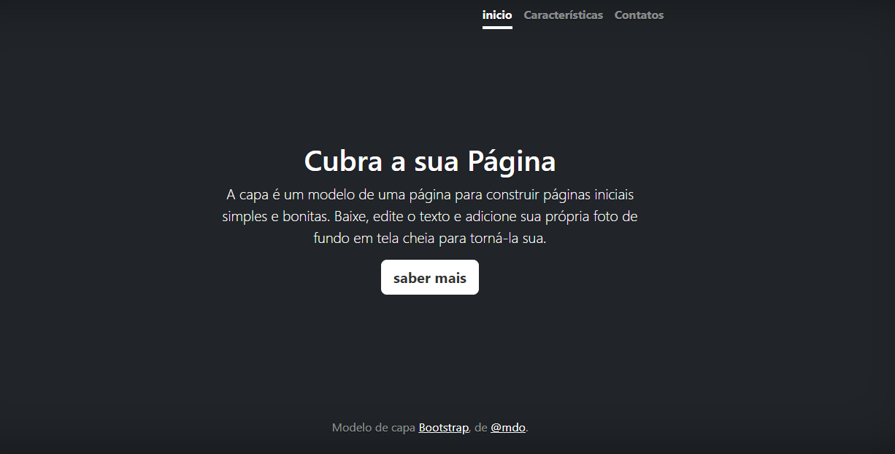
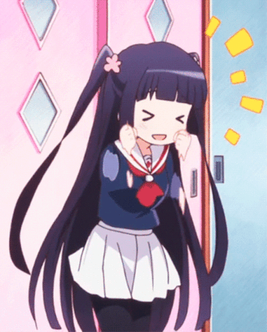

#índice

[ Projeto - aprendendo a escrever um REDME](#projeto---aprendendo-a-escrever-um-redme)  
[Descrição](#descri%C3%A7%C3%A3o)  
[Indrutução](#indrutu%C3%A7%C3%A3o)  
[funcionalidade](#funcionalidade)  
[Tecnologia utilizada](#tecnologias-utilizadas)  
[Fonte consultadas](#fonte-consultadas)  
[Autores](#autores)  

# Projeto - aprendendo a escrever um REDME

## Descrição
Nós, da empresa GUNA, desenvolvemos um modelo de capa para você desenvolvedor ou desenvolvedora usar toda a sua criatividade, um modelo você ja tem, agora cabe a você criar o que você quiser!

## Indrutução 

## Funcionalidade
Este site tem a funcionalidade de ajudar um desenvolvedor ou uma desenvolvedora a dar seus primeiros passos com um site, demos aquele empurrãozinho 😉

### Tecnologias utilizadas

Ás tecnologias utilizadas para este modelo de capa são: HTML5, CSS3, e BOOTSTRAP5.

## Fonte consultadas 

As Fontes utilizadas foram o Alura.com e o Github de lohan 

## Autores 